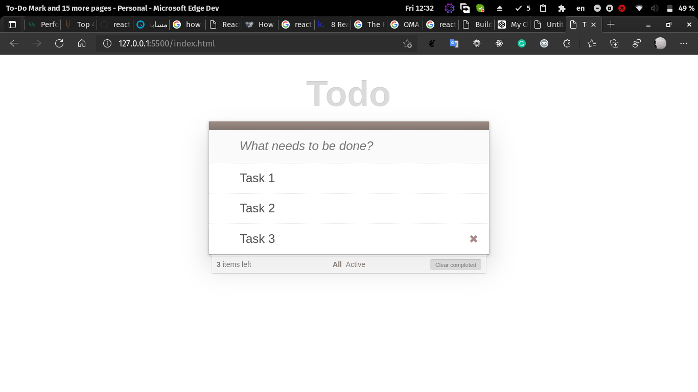
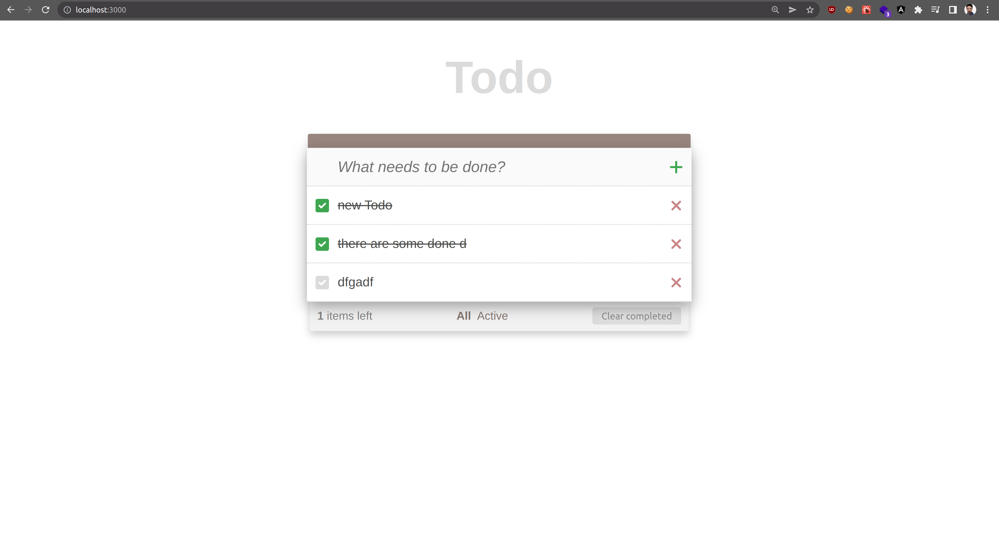

## _Todo list_


Todo list for Snapp shop task

- No css framework is used
- server is implemented with json-server
- a simple todo list webapp 

## Features

> Design


> Final

## Tech

This uses a number of open source projects:

- [ReactJS] - React makes it painless to create interactive UIs
- [Vite] - [Vitejs](https://vitejs.dev/) Next Generation Frontend Tooling
- [pnpm] - [pnpm](https://pnpm.io/) Fast, disk space efficient package manager
- [json-server] - a quick back-end for prototyping and mocking.


## Installation

pnpm and vite is used for more info visit : [Vitejs](https://vitejs.dev/) - [pnpm](https://pnpm.io/) .

Install the dependencies and devDependencies and start the webapp and server simply by `pnpm start`.

```sh
cd snapp-todolist
pnpm install
pnpm start
```


